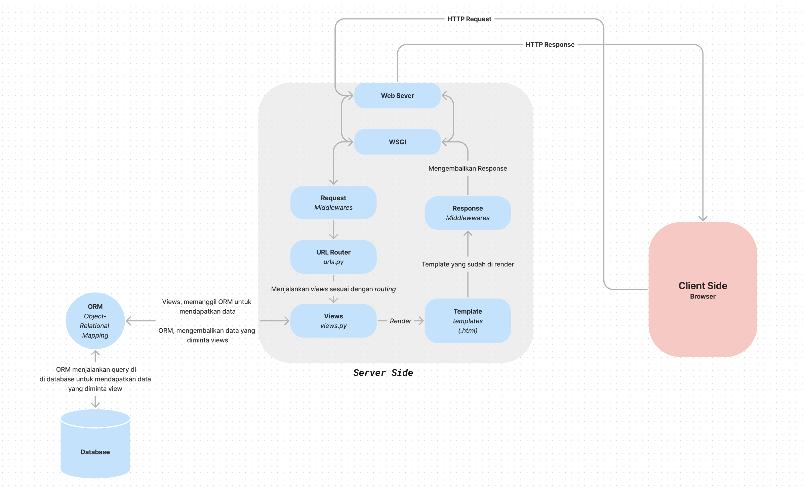

# KelolaToko

Muhammad Haekal Kalipaksi

PBP-F

2206817490

## Pertanyaan 1

**Jelaskan bagaimana cara kamu mengimplementasikan checklist di atas secara step-by-step (bukan hanya sekadar mengikuti tutorial).**

Dalam menyelesaikan checklist tugas, berikut adalah cara saya menimplementasikannya:

1. Pertama, saya membuat repository baru dengan nama [**KelolaToko-app**](https://github.com/mhmdhaekal/kelolaToko-app).

2. Dikarenakan saya menggunakan package dan enviroment manager _conda_ di macOS maka tahap selanjutnya adalah membuat environment baru dengan nama **tugas-2-env**, dengan cara:

```
conda create -n tugas-2-env
```

3. Setelah itu, saya membuat directory baru di dalam folder _TUGAS_ dengan nama tugas-2.
4. Membuat _requirements.txt_, lalu menginstall _dependencies_ yang dibutuhkan, dengan

```
pip install -r requirements.txt
```

5. Membuat project baru dengan django dengan nama **kelolaToko** lalu membuat apps dengan nama **main**

   ```
   django-admin startproject kelolaToko .
   ```

   ```
   python manage.py startapp main
   ```

6. Init repository

```
git init
git remote add origin [link into repo]
git add .
git commit -m "init repo"
git branch -M main
git push origin main
```

7. Menambahkan apps main kedalam settings.py dan mengubah whitelist host.
8. Membuat models untuk apps main.
9. Menambahkan models ke dalam admin.
10. Menjalankan makemigration dan migrate

```
python manage.py makemigrate
python manage.py migrate
```

11. Membuat folder templates didalam main dan membuat index.html, dikarenakan saya ingin menggunakan css maka saya menambahkan folder static yang berisi fonts dan styles.
12. Membuat function index didalam _views.py_ yang berfungsi mengembalikkan nama aplikasi, nama, kelas, dan daftar barang dari database menggunakan templates index.html.
13. Membuat routing untuk aplikasi main, dengan mengedit urls.py di dalam folder main.
14. Membuat routing untuk project, dengan menambahkan `/main` sebagai apps main di files urls.py folder kelolaToko.
15. Membuat test yang berfungsi untuk memastikan url _main_ ada, menggunakan templates _index.html_ serta memastikan nama aplikasi, nama, dan kelas sudah sesuai, lalu menjalankan:

```
python manage.py test
```

16. Menjalankan apps di localhost:3000 dan memastikan sudah sesuai requirements menggunakan:
    ```
    python manage.py runserver 3000
    ```
17. Setelah sesuai dengan requirements, saya melakukan git add, git commit, git push ke repository.
18. Langkah terakhir adalah ,membuat _deployment_ di platform **adaptable**, dengan cara memilih repository _kelolaToko-app_

## Pertanyaan 2

**Buatlah bagan yang berisi request client ke web aplikasi berbasis Django beserta responnya dan jelaskan pada bagan tersebut kaitan antara urls.py, views.py, models.py, dan berkas html**

Link : https://www.figma.com/file/WP1iYOAlzmEyTEA3Lbcphy/Untitled?type=whiteboard&node-id=0%3A1&t=eMH9AVntj3g5H06b-1

## Pertanyaan 3

**Jelaskan mengapa kita menggunakan virtual environment? Apakah kita tetap dapat membuat aplikasi web berbasis Django tanpa menggunakan virtual environment?**

Virtual environment merupakan suatu environment python khusus yang terisolasi. Secara bawaan python akan di install secara `global`, artinya seluruh project python yang dibuat akan memiliki _installed package_ dan versi yang sama. Terkadang, setiap project memiliki versi python atau _dependencies_ yang berbeda sehingga terjadi _conflict_ dan menyebabkan error.

Untuk mencegah hal tersebut, maka digunakan _virtual environment_. Ketika menggunakan setiap project akan mempunyai environment yang terisolasi, sehingga seluruh _installed package_ dan versi tidak akan mempengaruhi secara `global`. Selain itu, virtual environment digunakan untuk memastikan seluruh _dependencies_ sudah terpenuhi.

Tanpa menggunakan virtual enviroment tentu dapat membuat aplikasi web berbasis django jika dan hanya jika sudah melakukan instalasi Django di `global`. Namun, hal tersebut tidak direkomendasikan. Tanpa virtual enviroment, seluruh _dependencies_ akan diinstalasi secara global dan sangat mungkin untuk terjadi _conflict_ dan error.

## Pertanyaan 4

Jelaskan apakah itu MVC, MVT, MVVM dan perbedaan dari ketiganya.

**MVC**

_Models-View-Controller_

MVC merupakan singkatan dari Model, View, dan Controller. MVC merupakan _design pattern_ yang biasanya digunakan dalam pengembangan situs web. MVC membagi aplikasi ke dalam tiga komponen yaitu:

- Model: Representasi dalam memanipulasi data, model berfungsi dalam menyediakan fungsi/metode untuk mengakses, memanipulasi, dan mengelola data.
- View: Representasi dari _user interface_ dari sistem, view berfungsi untuk menampilkan _user interface_, menampilkan data, dan menerima input dari pengguna.
- Controller: Perantara antara views dan model, Controller berfungsi untuk menjadi perantara antara model dan view, seperti menjalankan fungsi/methods pada models atau mengubah tampilan.

**MVT**

_Models-View-Template_

MVT merupakan singkatan Models, View, dan Template. MVT merupakan _design pattern_ yang digunakan oleh framework Django. MVT membagi aplikasi ke dalam tiga komponen yaitu:

- Model: Representasi dalam memanipulasi data, model berfungsi dalam menyediakan fungsi/metode untuk mengakses, memanipulasi, dan mengelola data.
- View: Perantara antara model dan template, view berfungsi untuk menjadi perantara antar model dan template, seperti memanggil fungsi/_methods_ pada models dan _render_ template.
- Template: Representasi dari _user_interface_ dari sistem, template berfungsi untuk menampilkan _user interface_, menampilkan data, dan menerima input dari pengguna.

  **MVVM**

_Model-View-ViewModel_

MVVM merupakan singkatan dari Model-View-ViewModel. MVVC meruapkan _design patter_ yang memanfaatkan _client-side_ dalam pengembangan situs web. MVVC membagi aplikasi ke dalam tiga komponen yaitu:

- Model: Representasi dalam memanipulasi data, model berfungsi dalam menyediakan fungsi/metode untuk mengakses, memanipulasi, dan mengelola data.
- View: Representasi dari _user interface_ dari sistem, view berfungsi untuk menampilkan _user interface_, menampilkan data, dan menerima input dari pengguna.
- ViewModel: Perantaran antara model dan view, viewModel berfungsi untuk menjadi perantara antara model dan view, seperti menjalankan fungsi/methods pada models atau mengubah tampilan.

**Perbedaan antara MVC, MVT, dan MVVW**

- Perbedaan utama MVVW dengan MVC/MVT adalah MVVM menggunakan _client-side_ sedangkan MVC/MVT menggunakan _server-side_,
- Perbedaan utama MVT dengan MVC/MVVW adalah Views di MVT memiliki fungsi yang berbeda dengan views di MVC/MVVW. Views dalam MVT berfungsi seperti Controller di MVT dan viewModel di MVVW.
- Perbedaan lainnya antara MVT dengan MVC/MVVW adalah terdapat templates yang berfungsi sebagai View di MVC/MVVW.

### Rev00 : Rabu, 12 September 2023 9:38 PM
